> 除注明外，所有文章均采用 [Creative Commons BY-NC-ND 4.0](https://creativecommons.org/licenses/by-nc-nd/4.0/deed.zh)（自由转载-保持署名-非商用-禁止演绎）协议发布

<!-- TOC -->

- [动机](#动机)
- [网络结构](#网络结构)
- [改进](#改进)
- [解读](#解读)
- [引申](#引申)

<!-- /TOC -->
### 动机
---
退化现象：根据推理，只要网络解决vanishing/exploding problem等问题，而且不过拟合，那应该是越深越好，但随着网络加深，准确度却下降。

推理：退化说明网络不容易优化，假设往浅层网络A叠加几层layer形成网络B，如果这些新添加的layer是Identity mapping，那么网络B性能至少不会比A差。但实验结果却显示网络越深，性能越差，说明新添加的layer（非线性网络层）学习单位映射比较困难。

构思：寻找新的构建方法，随着深度的增加，训练误差不会增加。既然学习单位映射比较麻烦，不妨直接给它加上一个shortcut，直接给这个模块输出叠加上输入。实际情况中，单位映射x并不是最优解H(x)，最优解在单位映射附近，这个最优解与单位映射之间的差就叫做residual F(x)。F(x)=H(x)-x，实际证明训练网络学习残差F(x)比直接学习H(x)或者恒等映射更容易。

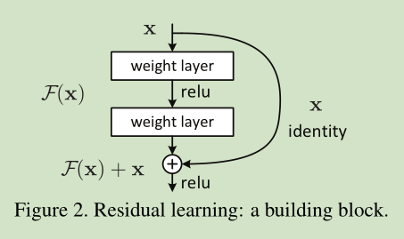

### 网络结构
---
直接使用shortcut将模块的输入叠加至输出，其中不添加参数，以下为将34层 plain 网络修改成 residual 网络。主要结构与PlainNet 一致，只是多了许多 shortCut 连接，或者看成许多个 residual block 堆叠而成。

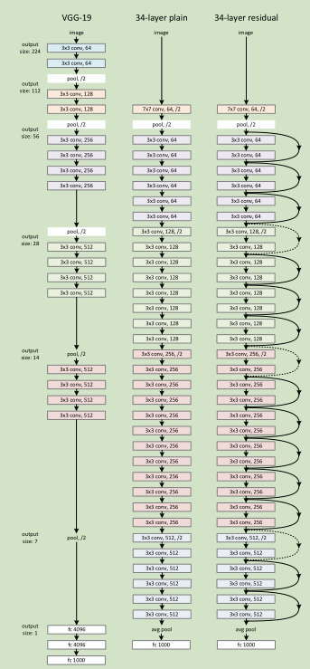

注意：虚线部分均处于维度增加部分，亦即卷积核数目倍增的过程，这时进行F(x)+x就会出现二者维度不匹配，论文中采用两种方法解决这一问题：
1. zero_padding:对恒等层进行0填充的方式将维度补充完整。这种方法不会增加额外的参数
2. projection:在恒等层采用1x1的卷积核来增加维度。这种方法会增加额外的参数

理解残差学习：假设多个非线性层能够逼近复杂的函数，这就等价于这些层能够逼近复杂的底层映射和残差函数，但学习后者比前者容易得多。可以理解为恒等映射提供合理的预处理，或者反向传播的梯度能更方便地传播到浅层网络。

收敛性能：残差网络增加了一定层数之后，并未出现性能退化，反而性能有了一定程度的提升：残差网络有着更低的收敛损失，同时也没有产生过高的过拟合。同时注意到，残差网络在浅层时并未表现出更多的优势，说明残差网络必须要配合较深的深度才能发挥其结构优势，与“平整”网络拉开性能差距。

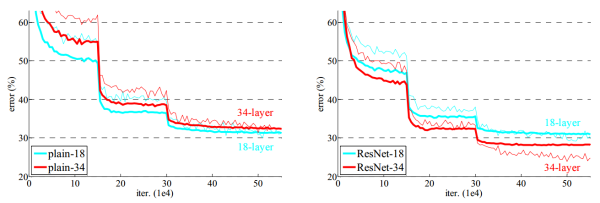

网络响应：残差网络中大部分层的响应方差都处在较低水平，这一定程度上印证了论文的假设：这些响应方差较低的层响应较为固定，很有可能权重近似于零，这也就是说其所对应的残差结构可能近似于单位映射,网络的实际有效层数是要比全部层数要少一些的，产生了跳过连接(Skip-connection)的作用。

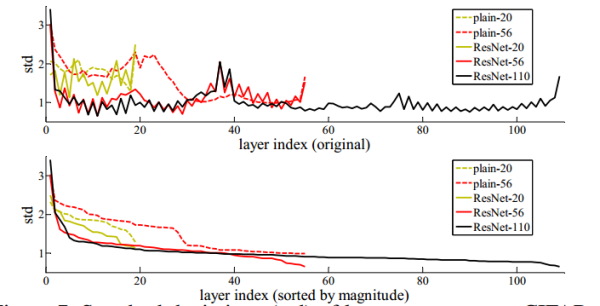

### 改进
---
深度困扰：110层以下的残差网络中性能与网络深度成正比，但在使用1202层残差网络模型时，分类性能出现了退化，甚至不如32层残差网络的表现。

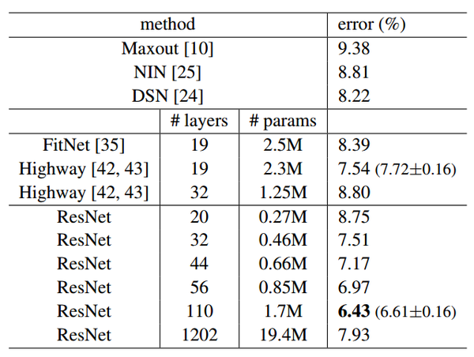

改进：研究估计极其深的深度网络可能深受梯度消失问题的困扰，基于反向传播法计算梯度优化的神经网络，由于反向传播求隐藏层梯度时利用了链式法则，梯度值会进行一系列的连乘，导致浅层隐藏层的梯度会出现剧烈的衰减，这也就是梯度消失问题的本源。

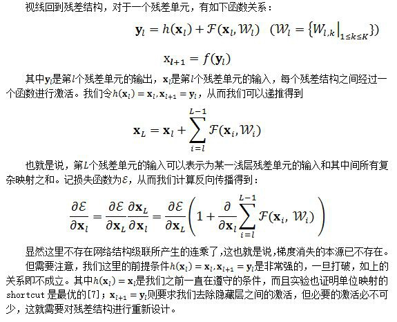

基于此对残差单元进行改进，确实得到更好效果。

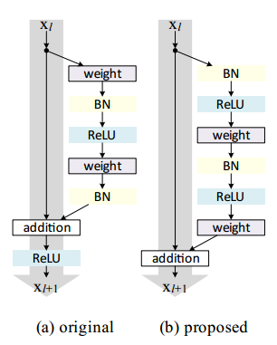

### 解读
---
残差网络单元其中可以分解成下图的形式，从图中可以看出，残差网络是由多种路径组合的一个网络。也就是说，残差网络是很多并行子网络的组合，整个残差网络相当于一个多人投票系统（Ensembling）

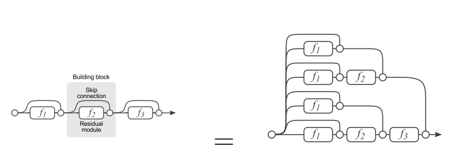

删除网络的一部分：如果把残差网络理解成一个Ensambling系统，那么网络的一部分就相当于少一些投票的人，如果只是删除一个基本的残差单元，对最后的分类结果应该影响很小；而最后的分类错误率应该与删除的残差单元的个数成正比的，论文里的结论也印证了这个猜测，下图是ResNet分类错误率和删除的基本残差网络单元个数的关系：

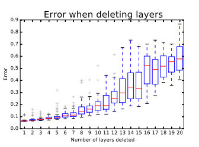

有效路径：说明虽然表面上ResNet网络很深，但是其实起实际作用的网络层数并没有很深，没有正面解决梯度消失的问题，有效的地方在于多人投票系统。论文通过各个路径长度上包含的网络数乘以每个路径的梯度值，得出大多数的梯度其实都集中在中间的路径上，论文里称为effective path。

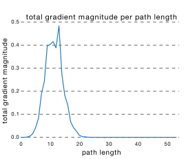

### 引申
根据resnet改进版的结果分析resnet成功的原因以及将来的发展方向

---
FractalNet：residual不是必须的；将resnet以一种规则的方式展开，侧面证明resnet的ensemble本质；droppath相当于增强了训练时的shallow net的独立性

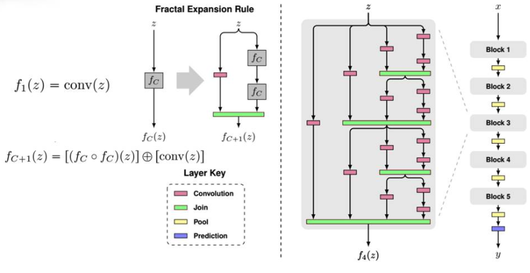

stochastic depth：某种程度证明resnet的ensemble本质；stochastic增快极深网络的训练过程；有助于减弱底层网络的梯度消失问题

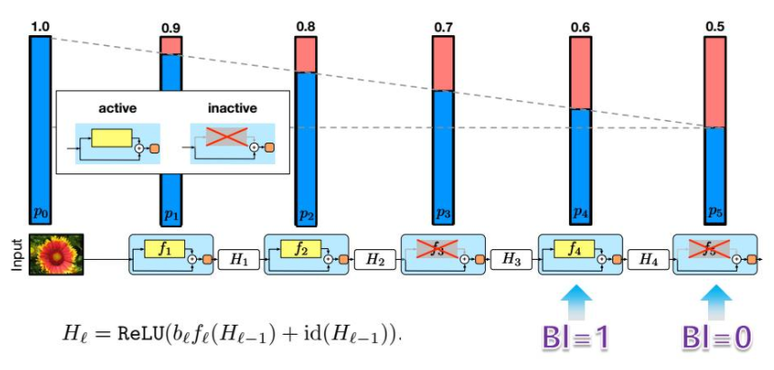

wide resnet：depth不是最重要的，block更重要；block中的dropout应该加在两个conv层之间；wide结构参数会比较多，注意过拟合问题

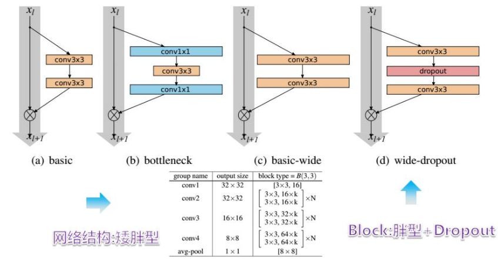

pyramidal resnet：block的设计很重要；resnet中不同的block重要性不同：带下采样的更重要，不能随便丢弃。

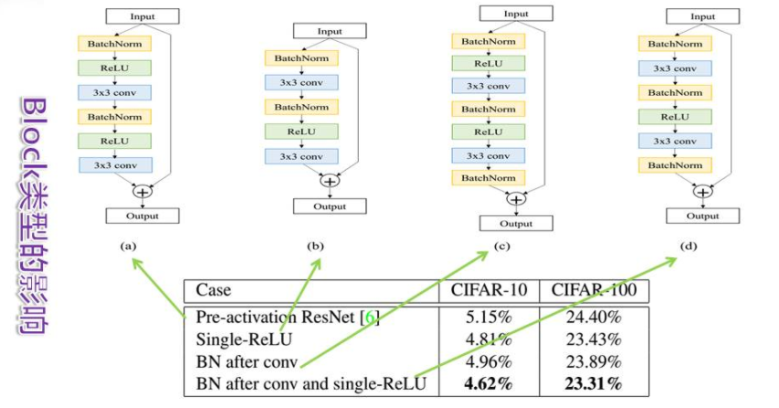

multiresidual block：深度是重要的，但是不是唯一重要的；block的宽度及由此引出的单block前向路径分支数也同等重要；影响ensemble中网络数量的两个关键因素：深度/单block分支数。

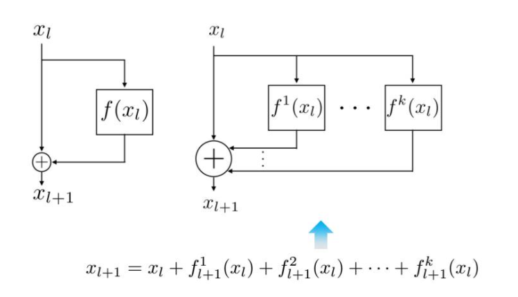

densenet：ensemble数量指数级增长，相当于block分支很多；把网络的每一层设计得特别窄，即只学习非常少的特征图（最极端情况就是每一层只学习一个特征图），达到降低冗余性的目的，不容易过拟合。

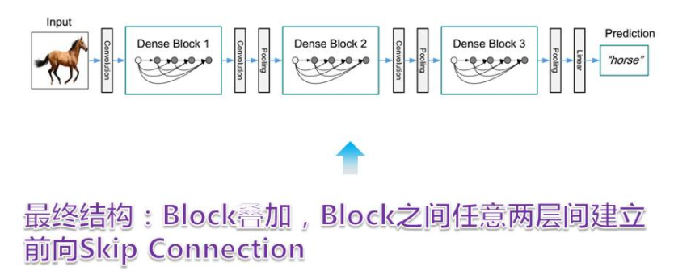

目前可以下的结论：
1. ensemble很可能是resnet以其改进模型成果的主要原因
1. 这意味着resnet等极深网络只是看上去深，本质上并不深，绕开了极深网络训练的问题而不是解决这个问题，如何训练极深网络仍然是个重要问题
1. 增加ensemble中包含的基础网络很可能增加网络性能
1. 增加ensemble的两种互相配合的主要方式：增加depth+单block的分支路径